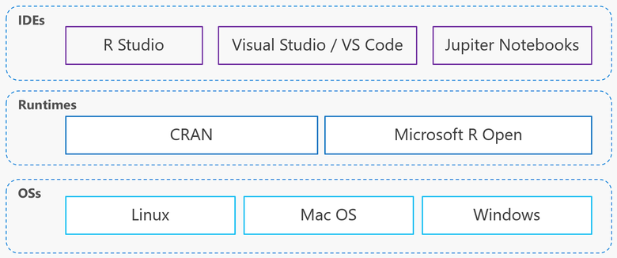

```{r setup, include=FALSE}
knitr::opts_chunk$set(echo = FALSE)
```


## Agenda
- About R 
- R features
- R: runtime, core packages, and IDEs
- Install R Ecosystem
- Launch and _Hello, R_ script


## About R

Класс языка: мультипарадигмальный (в т.ч. __функциональный__)

Тип исполнения: __интерпретируемый__

Типизация: __динамическая__

Платформы: __Unix, Mac OS, Windows__

Лицензий: __Open source__ (GNU GPL 2)

Год выпуска: 1993

Текущая версия: [3.6.2](https://cran.r-project.org/src/base/R-3/) (2019-12-12)

Сайт проекта:	[r-project.org](https://www.r-project.org/)


## R (ƒ)eatures

Нацелен на решение статистических задач и задач анализа данных

Мощный и лаконичный синтаксис

__Векторизация вычислений__ (SIMD) «из коробки»

Большое community со стороны __индустрии и академического сообщества__

__15000+__ вспомогательных библиотек (packages)

Зрелость языка и пакетов: __20+ лет существования__.


## R: runtime, core packages, and IDEs

- Multiple OSs, multiple R runtimes, multiple IDEs
- Possible to build a __software stack based only on Open Source__.

<div class="columns-2">
  
</div>


## Install R Ecosystem

0. Your PC host any of the following OS: Linux, Mac OS, Windows.
1. Use [CRAN](https://cran.r-project.org/) or [Microsoft R Open](https://mran.microsoft.com/documents/rro/installation) installation guide
2. Install your favourite free IDE: [RStudio](https://rstudio.com/products/rstudio/), [Jupiter Notebooks](https://jupyter.org/install), or
[Visual Studio Code](https://code.visualstudio.com/download).
3. Start programming! :)


## Hello, R!

```{r echo=TRUE}
print("Hello, R!")
```


Know your tools: [RStudio IDE Cheat Sheet](https://github.com/rstudio/cheatsheets/raw/master/rstudio-ide.pdf)
