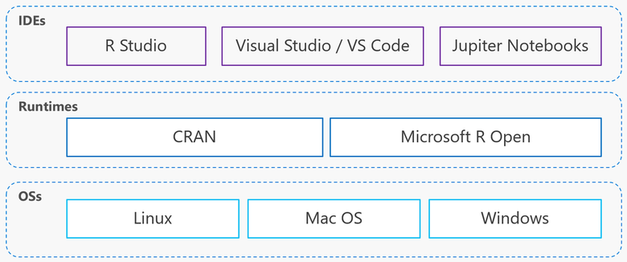

```{r setup, include=FALSE}
knitr::opts_chunk$set(echo = FALSE)
```


## Agenda

- About R 
- R features
- R: runtime, core packages, and IDEs
- Install R Ecosystem
- Launch and _Hello, R_ script


## About R (programming language)

<font size="5">
Paradigms: multi-paradigm (including __functional__)

Runtime: __interpreted__

Typing discipline: __dynamic__

Supported OS: __Unix, Mac OS, Windows__

License: __Open source__ (GNU GPL 2)

First appeared: 1993

Stable release: [3.6.2](https://cran.r-project.org/src/base/R-3/) (2019-12-12)

Website:	[r-project.org](https://www.r-project.org/)
</font>


## R (ƒ)eatures

<font size="5">

Нацелен на решение статистических задач и задач анализа данных

__Векторизация вычислений__ (SIMD) «из коробки»

__15000+ специализированных__ библиотек (packages)

Возможность исполнять код на __R, C, Python__

Большое community со стороны __индустрии и академического сообщества__

Зрелость языка и пакетов: __20+ лет существования__

Мощный и лаконичный синтаксис

Удобная IDE, возможности по визуализации, работа с markdown-разметкой

___Это все сделано на R!___

</font>


## R: runtime, core packages, and IDEs

<font size="5">

- Multiple OSs, multiple R runtimes, multiple IDEs, terminal (console)
- Possible to build a __software stack based only on Open Source__
- Available via cloud platforms: Microsoft Azure, AWS, Google Cloud.

</font>

<div class="columns-2">
  
</div>


## Install R Ecosystem

0. Your PC host any of the following OS: Linux, Mac OS, Windows.
1. Use [CRAN](https://cran.r-project.org/) or [Microsoft R Open](https://mran.microsoft.com/documents/rro/installation) installation guide
2. Install your favourite free IDE: [RStudio](https://rstudio.com/products/rstudio/), [Jupiter Notebooks](https://jupyter.org/install), or
[Visual Studio Code](https://code.visualstudio.com/download).
3. (Optional) [Install Git](https://git-scm.com/book/en/v2/Getting-Started-Installing-Git)

-- or

1. Use Data Science VM images in Azure, AWS, Google Cloud, etc.


And **start programming!** :)


## Hello, R!

```{r echo=TRUE}
print("Hello, R!")
```

<font size="5">
Know your tools! Read [RStudio IDE Cheat Sheet](https://github.com/rstudio/cheatsheets/raw/master/rstudio-ide.pdf)
</font>


## Hello, Git!

<font size="5">
Clone this repository from GitHub:
</font>

```
# enter in the terminal
git clone https://github.com/codez0mb1e/StarRter.git
```


## Conclusion

<font size="4">
[Back to Course program](/)
</font>
