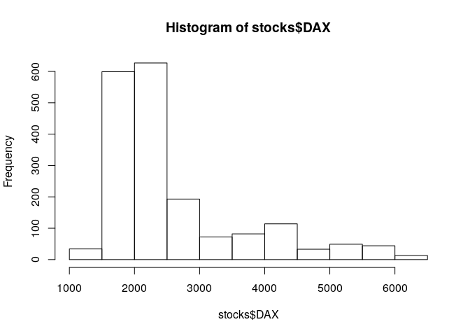
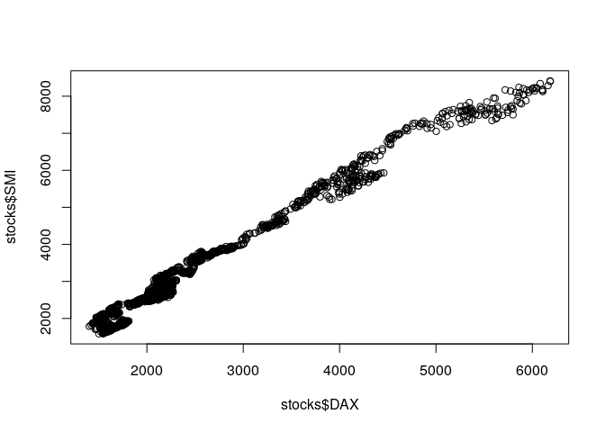
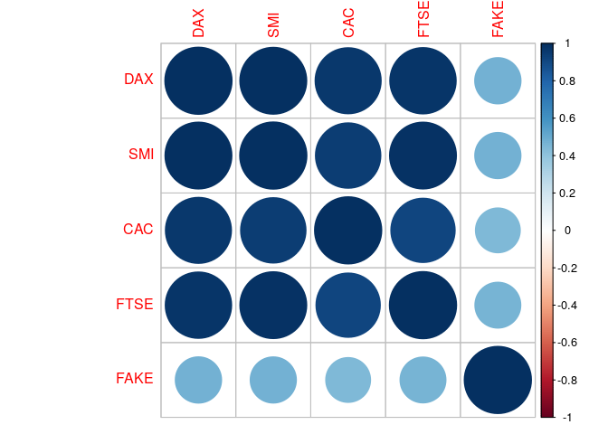
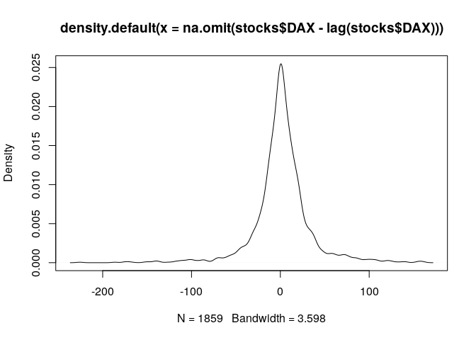

## Install packages

Install dataset package:

```r
install.packages("datasets") 
```

```
## Installing package into '/home/dp/R/x86_64-pc-linux-gnu-library/3.5'
## (as 'lib' is unspecified)
```

```
## Warning: package 'datasets' is not available (for R version 3.5.3)
```

```
## Warning: package 'datasets' is a base package, and should not be updated
```

```r
?datasets # short version
library(help = "datasets") # or complete list of datasets
```

Loading / attaching package:

```r
library(datasets)
```


## Create data frame

Create new data frame:

```r
df <- data.frame(
  col1 = 1:10,
  col2 = seq(1, 20, by = 2),
  col3 = rep(Sys.time(), times = 10)
)
```

...or load existing data frame:


```r
library(datasets)
library(dplyr)
```

```
## 
## Attaching package: 'dplyr'
```

```
## The following objects are masked from 'package:stats':
## 
##     filter, lag
```

```
## The following objects are masked from 'package:base':
## 
##     intersect, setdiff, setequal, union
```

```r
# load
stocks <- EuStockMarkets 

# transform time-series to data table
stocks <- as_tibble(stocks)
```


## Discovery data frame structure

View data:

```r
head(stocks)
```

<div data-pagedtable="false">
  <script data-pagedtable-source type="application/json">
{"columns":[{"label":["DAX"],"name":[1],"type":["dbl"],"align":["right"]},{"label":["SMI"],"name":[2],"type":["dbl"],"align":["right"]},{"label":["CAC"],"name":[3],"type":["dbl"],"align":["right"]},{"label":["FTSE"],"name":[4],"type":["dbl"],"align":["right"]}],"data":[{"1":"1628.75","2":"1678.1","3":"1772.8","4":"2443.6"},{"1":"1613.63","2":"1688.5","3":"1750.5","4":"2460.2"},{"1":"1606.51","2":"1678.6","3":"1718.0","4":"2448.2"},{"1":"1621.04","2":"1684.1","3":"1708.1","4":"2470.4"},{"1":"1618.16","2":"1686.6","3":"1723.1","4":"2484.7"},{"1":"1610.61","2":"1671.6","3":"1714.3","4":"2466.8"}],"options":{"columns":{"min":{},"max":[10]},"rows":{"min":[10],"max":[10]},"pages":{}}}
  </script>
</div>

```r
tail(stocks)
```

<div data-pagedtable="false">
  <script data-pagedtable-source type="application/json">
{"columns":[{"label":["DAX"],"name":[1],"type":["dbl"],"align":["right"]},{"label":["SMI"],"name":[2],"type":["dbl"],"align":["right"]},{"label":["CAC"],"name":[3],"type":["dbl"],"align":["right"]},{"label":["FTSE"],"name":[4],"type":["dbl"],"align":["right"]}],"data":[{"1":"5598.32","2":"7952.9","3":"4041.9","4":"5680.4"},{"1":"5460.43","2":"7721.3","3":"3939.5","4":"5587.6"},{"1":"5285.78","2":"7447.9","3":"3846.0","4":"5432.8"},{"1":"5386.94","2":"7607.5","3":"3945.7","4":"5462.2"},{"1":"5355.03","2":"7552.6","3":"3951.7","4":"5399.5"},{"1":"5473.72","2":"7676.3","3":"3995.0","4":"5455.0"}],"options":{"columns":{"min":{},"max":[10]},"rows":{"min":[10],"max":[10]},"pages":{}}}
  </script>
</div>


Data slices:

```r
stocks[1, ]
```

<div data-pagedtable="false">
  <script data-pagedtable-source type="application/json">
{"columns":[{"label":["DAX"],"name":[1],"type":["dbl"],"align":["right"]},{"label":["SMI"],"name":[2],"type":["dbl"],"align":["right"]},{"label":["CAC"],"name":[3],"type":["dbl"],"align":["right"]},{"label":["FTSE"],"name":[4],"type":["dbl"],"align":["right"]}],"data":[{"1":"1628.75","2":"1678.1","3":"1772.8","4":"2443.6"}],"options":{"columns":{"min":{},"max":[10]},"rows":{"min":[10],"max":[10]},"pages":{}}}
  </script>
</div>

```r
stocks[10:20, ]
```

<div data-pagedtable="false">
  <script data-pagedtable-source type="application/json">
{"columns":[{"label":["DAX"],"name":[1],"type":["dbl"],"align":["right"]},{"label":["SMI"],"name":[2],"type":["dbl"],"align":["right"]},{"label":["CAC"],"name":[3],"type":["dbl"],"align":["right"]},{"label":["FTSE"],"name":[4],"type":["dbl"],"align":["right"]}],"data":[{"1":"1645.89","2":"1716.3","3":"1754.3","4":"2497.4"},{"1":"1647.84","2":"1723.8","3":"1759.8","4":"2532.5"},{"1":"1638.35","2":"1730.5","3":"1755.5","4":"2556.8"},{"1":"1629.93","2":"1727.4","3":"1758.1","4":"2561.0"},{"1":"1621.49","2":"1733.3","3":"1757.5","4":"2547.3"},{"1":"1624.74","2":"1734.0","3":"1763.5","4":"2541.5"},{"1":"1627.63","2":"1728.3","3":"1762.8","4":"2558.5"},{"1":"1631.99","2":"1737.1","3":"1768.9","4":"2587.9"},{"1":"1621.18","2":"1723.1","3":"1778.1","4":"2580.5"},{"1":"1613.42","2":"1723.6","3":"1780.1","4":"2579.6"},{"1":"1604.95","2":"1719.0","3":"1767.7","4":"2589.3"}],"options":{"columns":{"min":{},"max":[10]},"rows":{"min":[10],"max":[10]},"pages":{}}}
  </script>
</div>

```r
stocks[10:20, c(1, 3)]
```

<div data-pagedtable="false">
  <script data-pagedtable-source type="application/json">
{"columns":[{"label":["DAX"],"name":[1],"type":["dbl"],"align":["right"]},{"label":["CAC"],"name":[2],"type":["dbl"],"align":["right"]}],"data":[{"1":"1645.89","2":"1754.3"},{"1":"1647.84","2":"1759.8"},{"1":"1638.35","2":"1755.5"},{"1":"1629.93","2":"1758.1"},{"1":"1621.49","2":"1757.5"},{"1":"1624.74","2":"1763.5"},{"1":"1627.63","2":"1762.8"},{"1":"1631.99","2":"1768.9"},{"1":"1621.18","2":"1778.1"},{"1":"1613.42","2":"1780.1"},{"1":"1604.95","2":"1767.7"}],"options":{"columns":{"min":{},"max":[10]},"rows":{"min":[10],"max":[10]},"pages":{}}}
  </script>
</div>


Data frame metadata:

```r
print(dim(stocks))
```

```
## [1] 1860    4
```

```r
print(str(stocks))
```

```
## Classes 'tbl_df', 'tbl' and 'data.frame':	1860 obs. of  4 variables:
##  $ DAX : num  1629 1614 1607 1621 1618 ...
##  $ SMI : num  1678 1688 1679 1684 1687 ...
##  $ CAC : num  1773 1750 1718 1708 1723 ...
##  $ FTSE: num  2444 2460 2448 2470 2485 ...
## NULL
```

```r
print(summary(stocks))
```

```
##       DAX            SMI            CAC            FTSE     
##  Min.   :1402   Min.   :1587   Min.   :1611   Min.   :2281  
##  1st Qu.:1744   1st Qu.:2166   1st Qu.:1875   1st Qu.:2843  
##  Median :2141   Median :2796   Median :1992   Median :3247  
##  Mean   :2531   Mean   :3376   Mean   :2228   Mean   :3566  
##  3rd Qu.:2722   3rd Qu.:3812   3rd Qu.:2274   3rd Qu.:3994  
##  Max.   :6186   Max.   :8412   Max.   :4388   Max.   :6179
```

```r
skimr::skim_to_list(stocks)
```

```
## $numeric
## # A tibble: 4 x 12
##   variable missing complete n     mean    sd       p0       p25      p50      p75    p100    hist   
## * <chr>    <chr>   <chr>    <chr> <chr>   <chr>    <chr>    <chr>    <chr>    <chr>  <chr>   <chr>  
## 1 CAC      0       1860     1860  2227.83 " 580.3… "1611  … 1875.15  "1992.3… 2274.… "4388.… ▇▆▁▂▁▁…
## 2 DAX      0       1860     1860  2530.66 1084.79  1402.34  "1744.1… 2140.56  2722.… 6186.09 ▇▇▁▁▂▁…
## 3 FTSE     0       1860     1860  3565.64 " 976.7… "2281  … 2843.15  "3246.6… 3993.… "6179 … ▆▇▅▃▂▂…
## 4 SMI      0       1860     1860  3376.22 1663.03  "1587.4… 2165.62  2796.35  3812.… "8412 … ▇▇▃▁▂▁…
```

## Descriptive statistics in R

Statistics types:

- Center: mean(), median()
- Spread: sd(), IQR(), mad()
- Range: min(), max(), quantile()
- Position: first(), last(), nth(),
- Count: n(), n_distinct()


```r
min(stocks$DAX)
```

```
## [1] 1402.34
```

```r
mean(stocks$CAC)
```

```
## [1] 2227.828
```

```r
max(stocks$FTSE)
```

```
## [1] 6179
```


```r
library(tidyr)

funs <- list(min, mean, median, sd, var, IQR, max)

stocks %>% 
  gather(stock, close) %>% 
  group_by(stock) %>% 
  summarise_all(funs)
```

<div data-pagedtable="false">
  <script data-pagedtable-source type="application/json">
{"columns":[{"label":["stock"],"name":[1],"type":["chr"],"align":["left"]},{"label":["fn1"],"name":[2],"type":["dbl"],"align":["right"]},{"label":["fn2"],"name":[3],"type":["dbl"],"align":["right"]},{"label":["fn3"],"name":[4],"type":["dbl"],"align":["right"]},{"label":["fn4"],"name":[5],"type":["dbl"],"align":["right"]},{"label":["fn5"],"name":[6],"type":["dbl"],"align":["right"]},{"label":["fn6"],"name":[7],"type":["dbl"],"align":["right"]},{"label":["fn7"],"name":[8],"type":["dbl"],"align":["right"]}],"data":[{"1":"CAC","2":"1611.00","3":"2227.828","4":"1992.300","5":"580.3142","6":"336764.6","7":"399.200","8":"4388.50"},{"1":"DAX","2":"1402.34","3":"2530.657","4":"2140.565","5":"1084.7927","6":"1176775.3","7":"978.265","8":"6186.09"},{"1":"FTSE","2":"2281.00","3":"3565.643","4":"3246.600","5":"976.7155","6":"953973.2","7":"1150.425","8":"6179.00"},{"1":"SMI","2":"1587.40","3":"3376.224","4":"2796.350","5":"1663.0265","6":"2765657.0","7":"1646.800","8":"8412.00"}],"options":{"columns":{"min":{},"max":[10]},"rows":{"min":[10],"max":[10]},"pages":{}}}
  </script>
</div>

See also: https://www.statsandr.com/blog/descriptive-statistics-in-r/ 


## Vizualization

```r
library(ggplot2)

df <- stocks %>% gather(stock, close)
```

### Histogram


```r
hist(stocks$DAX)
```

<!-- -->


### Boxplot


```r
boxplot(df$close ~ df$stock)
```

<!-- -->

```r
boxplot(log(df$close) ~ df$stock)
```

<!-- -->


### Scatterplot

```r
plot(stocks$DAX, stocks$SMI)
```

<!-- -->


### Correlation plot

```r
library(corrplot)
```

```
## corrplot 0.84 loaded
```

```r
fake_trades <- stocks$DAX - rnorm(nrow(stocks), mean = 1000, sd = 2000)
              
M <- cor(stocks %>% mutate(FAKE = fake_trades))
print(M)
```

```
##            DAX       SMI       CAC      FTSE      FAKE
## DAX  1.0000000 0.9911539 0.9662274 0.9751778 0.4977401
## SMI  0.9911539 1.0000000 0.9468139 0.9899691 0.4957091
## CAC  0.9662274 0.9468139 1.0000000 0.9157265 0.4797820
## FTSE 0.9751778 0.9899691 0.9157265 1.0000000 0.4888864
## FAKE 0.4977401 0.4957091 0.4797820 0.4888864 1.0000000
```

```r
corrplot(M)
```

<!-- -->


```r
corrplot(M,
         method = "square",
         order = "hclust", diag = F, tl.col = "black", tl.cex = 0.7,
         title = "Stocks correlation matrix",
         mar = c(0,1,2,0))
```

<!-- -->


### Density plot


```r
plot(density(stocks$DAX))
```

<!-- -->

```r
plot(density(na.omit(stocks$DAX - lag(stocks$DAX))))
```

<!-- -->


